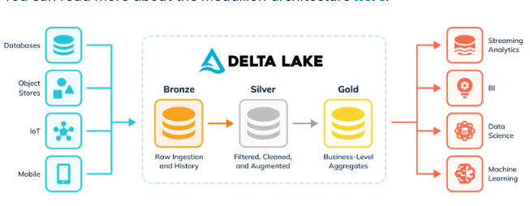

# ETL com Pyspark

> Este repositorio contem uma aplicacao pratica de um processo de ETL utilizando Pyspark.

### Arquitetura Medallion - Lakehouse

### Caracteristicas do Dataset

### Fluxo de trabalho

### Como executar este Projeto

### 

### 
